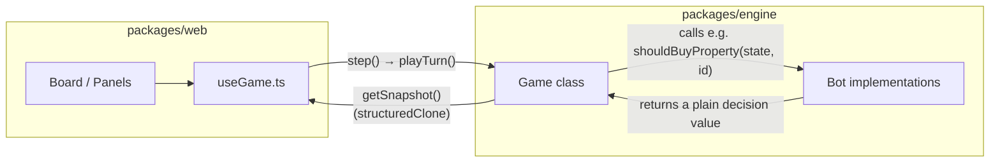

# Monopoly Arena

A Monopoly simulation engine and animated web UI for pitting AI bots against each other (or against you) to find the best strategies.

## Overview

- **Two packages, one hard boundary**: a UI-free rules engine (`packages/engine`) and a web app that treats it as a black box (`packages/web`). The engine never imports anything from the web package.
- **Bots are pure functions**: `(gameState, playerId) → decision`. No mutation, no hidden state, no reference to the live game — so a new strategy can be as small as an object literal.
- **Deterministic by construction**: every random outcome (dice, shuffles, turn order) goes through an injectable RNG, so the same seed always replays the same game — the basis for the test suite and, later, batch tournaments.
- **Status**: full ruleset implemented (buying, auctions, trading, building, mortgages, jail, bankruptcy, win detection) with four reference bots. Next up is a roadmap of new bot types — see [Roadmap: bot types](#roadmap-bot-types).

## Packages

- **`packages/engine`** — TypeScript rules engine: board, dice, cards, turns, houses/hotels, mortgages, auctions, trading, bankruptcy.
- **`packages/web`** — Vite + React app: an animated CSS-grid board, live bankroll/log panels, and a scrubbable turn-by-turn timeline.

## Architecture



The web layer never reaches into the engine's internals — it calls `playTurn()` and reads back an
immutable snapshot. The engine never reaches into the web layer — it just calls whichever `Bot` is
attached to the current player and reads back a plain value.

### `packages/engine`

A single mutable `Game` class (`game.ts`) plus pure data/helper modules it operates on:

- **`types.ts`** — `GameState` (players, ownership, spaces, log, turn — the one object holding all
  mutable game data), plus the `Bot`/`BotDecisions` interface: the entire surface a bot can act
  through (`shouldBuyProperty`, `chooseHouseToBuild`, `shouldPayToLeaveJail`, `raiseCash`,
  `chooseFinanceAction`, `auctionBid`, `proposeTrade`, `evaluateTrade`).
- **`board.ts`** — the static 40-space board layout, and `GROUP_MEMBERS` (spaces grouped by
  color/railroad/utility) derived from it once, so nothing else hand-maintains a second copy.
- **`cards.ts`** — the real 16-card Chance and Community Chest decks.
- **`dice.ts`** — `rollDice(rng)`. The engine never calls `Math.random()` directly; every random
  decision goes through an injectable `Rng`, which is how tests get fully deterministic games.
- **`bots/`** — four reference bots (`naive`, `random`, `orangeRush`, `railroadBaron`) built on a
  shared `Bot`/`BotDecisions` contract — a bot cannot mutate state, hold a reference to the
  `Game`, or see any other player's private info beyond what `GameState` already exposes.

**Turn flow** (`Game.playTurn()`), in order:

1. Jail handling — pay fine / use card / roll for doubles / stay put
2. Roll-and-move loop — keeps going through doubles chains (capped at 3 before jail)
3. Trade phase — one propose/accept-or-reject cycle
4. Build phase
5. Finance phase — mortgage / unmortgage / sell house
6. Win check, then advance to the next non-bankrupt player

Every mutation (`buy`, `payPlayer`, `sendToJail`, `applyCard`, ...) is a private `Game` method that
mutates `this.state` directly and appends a line to `state.log`. `getSnapshot()` returns a
`structuredClone` of that state, so external callers — bots, the web layer, tests — only ever see
an immutable copy and can't corrupt the live game.

**Move tracking**: every move pushes a `MoveEvent` (`{ playerId, from, to, type: "walk" |
"teleport", direction }`) onto `state.moves`, reset each turn. It exists purely so the web layer
can animate a turn's actual path (including multi-step doubles chains, or a roll followed by a
card that sends the player to jail) — the engine itself never reads it back.

### `packages/web`

A Vite + React app (`main.tsx` → `App.tsx`) that holds one `Game` instance in a ref and never
touches its private methods:

- **`useGame.ts`** — the state-management core. Beyond "call the engine and re-render":
  - **Timeline history**: stores one lightweight `TurnRecord` per turn (everything except
    `spaces`, a constant, and `log`, replaced by a length) instead of a full snapshot — avoids
    O(turns²) memory growth from duplicating the ever-growing log in every record. A past turn's
    display state is reconstructed by slicing the live, append-only log.
  - **Movement animation**: `animateTurn()` replays a turn's `MoveEvent`s — hopping tile-by-tile
    for a walk, fading for a teleport — through a `displayOverride` state. Timings scale with the
    speed slider; a checkbox disables animation entirely, instantly (no CSS transition either).
  - **Bot roster**: swapping a lineup selector or hitting Reset just constructs a fresh `Game`.
- **`Board.tsx`** — 40 spaces on an 11×11 CSS grid. A handful of shared `edge*` functions are the
  single source of truth for "which way does content on this side of the board face," so every
  tile's icon/price/houses derive from the same rotation value. Player tokens are an
  absolutely-positioned overlay layer (not tile children) so they can animate independently; the
  Jail tile has two sub-positions — the inset cell for imprisoned tokens, the outer strip for
  everyone else.
- **`boardLayout.ts`** — shared layout math, color palettes, and the icon-per-player-index used
  consistently across board tokens, monopoly badges, and the player panel.
- **Everything else is a thin, presentational view over the same `state`**: `PlayerPanel`
  (compact scoreboard), `PropertiesPanel` (deed rack + monopoly badges), `BankrollChart`
  (hand-rolled SVG, no charting library), `Timeline` (the scrub slider), `LineupPicker`
  (bot-selection dropdowns), `LogFeed`.

## Getting started

```bash
npm install
npm test          # run engine tests
npm run dev        # launch the web UI (http://localhost:5173)
```

## Current state

**Implemented**:

- Full board, dice-determined turn order (ties re-roll among just the tied players)
- Buying, and auctions when a player declines to buy
- Single-shot trading — properties, cash, Get Out of Jail Free cards, plus an optional rent
  waiver/cap condition — one propose/accept-or-reject cycle
- Rent (properties, railroads, utilities)
- House/hotel building with even-building enforcement, and selling back to the bank
- Mortgaging/unmortgaging, including automatic cash-raising to avoid bankruptcy
- The full 16-card Chance and Community Chest decks
- Jail, doubles, bankruptcy (with property transfer to creditor), win detection
- Four reference bots: `NaiveBot`, `RandomBot`, `OrangeRushBot`, `RailroadBaronBot`

**Not yet implemented**:

- Multi-round trade negotiation (counter-offers) — trading today is a single propose/accept-or-reject cycle

## Roadmap: bot types

The bot-as-pure-function architecture is deliberately open-ended — anything implementing the 8
`BotDecisions` methods can play. The plan is a sequence of bot types, ordered by shared
architectural dependency rather than by feature:

1. **Search-based bots (expectimax/MCTS)** — game-tree search over dice/card outcomes instead of
   fixed heuristics. Fully synchronous like the existing reference bots, but needs one new engine
   capability: simulating hypothetical future turns from a given `GameState` without mutating the
   live game (today `Game` only constructs a fresh game, not one resumed from a mid-game snapshot).
2. **Headless batch simulation + stats dashboard** — a UI-free runner that plays many games
   back-to-back and reports win rate / game length / property value trends. Useful on its own, and
   a hard prerequisite for NEAT (next), whose fitness evaluation needs thousands of games/generation.
3. **NEAT-evolved bot** — a small neural network (numeric inputs for player/property state, one
   output per decision type) evolved via neuroevolution self-play, built on the batch runner
   above. Not LLM-based — inference is a few matrix multiplies, microseconds, no API cost, which
   is what makes it the only bot type suited to million-game tournaments. Open question: evolve
   in-process in TypeScript, or drive an external process (most mature NEAT libraries are Python)
   via a decision-protocol bridge that may end up shared with the remote bot below.
4. **Async-aware engine core** — `Game.playTurn()` currently calls bot decision methods inline and
   synchronously. Three future player types — human players (pause for UI input), LLM-backed bots
   (network latency), and remote/HTTP bots (network round-trip) — all need the engine to await a
   decision instead of assuming one comes back instantly, so this is a single shared prerequisite
   rather than three separate efforts.
5. **Human player, LLM bots, and a "bring your own bot" API** — three independent integrations
   once the engine can await a decision. LLM bots (local via Ollama, or a low-cost hosted model)
   need per-decision-type structured/constrained output — a schema per `BotDecisions` method —
   since, unlike the existing bots, their responses can't be trusted to already be well-typed. A
   remote HTTP bot is the same idea decoupled from any specific backend: anything that speaks the
   decision protocol can play, whether it's an LLM, a script, or a search-based bot of its own.
